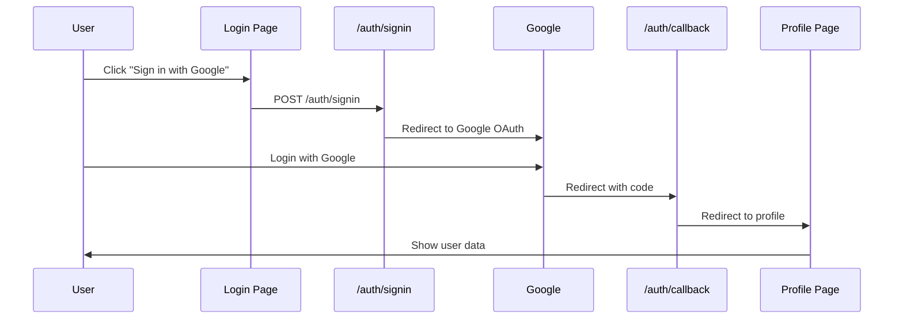

# 🚀 Frontend Developer Guide

_Note: Profile page, login page, error page nya cuma buat testing purposes. Yang penting liat flow nya aja._

## 🏗️ Architecture

```
Frontend (Client)     →     Backend (Server)     →     External
─────────────────           ─────────────────           ────────
Login Page           →     /auth/signin         →     Google OAuth
                    ←      /auth/callback       ←
Profile Page         →     /auth/signout        →     Supabase
Error Page
```

## 🔄 Authentication Flow

### **Complete Flow Diagram**



### **Step-by-Step Process**

1. **User clicks "Sign in with Google"**
   - Frontend calls `POST /auth/signin`
2. **Server initiates OAuth**
   - Server calls `supabase.auth.signInWithOAuth()`
   - Returns Google OAuth URL
3. **User redirected to Google**
   - User logs in with Google account
   - Google redirects back with authorization code
4. **Callback processing**
   - `/auth/callback` receives the code
   - Exchanges code for session token
   - Redirects to profile page
5. **Session established**
   - User is now authenticated
   - Can access protected routes

## 📁 File Structure

```
app/
├── auth/
│   ├── signin/route.js      # Initiate Google OAuth
│   ├── callback/route.js    # Handle OAuth callback
│   └── signout/route.js     # Handle logout
├── login/page.jsx           # Login UI with Google button
├── profile/page.jsx         # Protected page showing user data
├── error/page.jsx           # Error handling page
└── page.js                  # Home page

utils/supabase/
├── client.js                # Browser Supabase client
├── server.js                # Server Supabase client
└── middleware.js            # Auth middleware

middleware.js                # Route protection
```

## Quick Start untuk Tim Frontend

### **1. Sign In Implementation**

```jsx
// Login Button Component
'use client';

import { Button } from '@/components/ui/button';

export default function LoginButton() {
  const handleSignIn = async () => {
    const response = await fetch('/auth/signin', {
      method: 'POST',
    });

    if (response.redirected) {
      window.location.href = response.url;
    }
  };

  return <Button onClick={handleSignIn}>Sign in with Google</Button>;
}
```

### **2. Sign Out Implementation**

#### **Option A: Server Action (Recommended)**

```jsx
// Server Action (di Server Component)
import { createClient } from '@/utils/supabase/server';
import { redirect } from 'next/navigation';

async function signOut() {
  'use server';

  const supabase = await createClient();
  await supabase.auth.signOut();
  redirect('/');
}

// Component
<form action={signOut}>
  <Button type="submit">Sign Out</Button>
</form>;
```

#### **Option B: API Route**

```jsx
// Client Component
const handleSignOut = async () => {
  const response = await fetch('/auth/signout', {
    method: 'POST',
  });

  if (response.redirected) {
    window.location.href = response.url;
  }
};

<Button onClick={handleSignOut}>Sign Out</Button>;
```

### **3. Get User Data**

#### **Server Component (Recommended)**

```jsx
import { createClient } from '@/utils/supabase/server';

export default async function ProfilePage() {
  const supabase = await createClient();

  const {
    data: { user },
  } = await supabase.auth.getUser();

  if (!user) {
    redirect('/login');
  }

  return (
    <div>
      <h1>Welcome, {user.user_metadata?.full_name}!</h1>
      <p>Email: {user.email}</p>
      
    </div>
  );
}
```

#### **Client Component**

```jsx
'use client';

import { createClient } from '@/utils/supabase/client';
import { useEffect, useState } from 'react';

export default function UserProfile() {
  const [user, setUser] = useState(null);
  const supabase = createClient();

  useEffect(() => {
    const getUser = async () => {
      const {
        data: { user },
      } = await supabase.auth.getUser();
      setUser(user);
    };

    getUser();
  }, []);

  if (!user) return <div>Loading...</div>;

  return (
    <div>
      <h1>Welcome, {user.user_metadata?.full_name}!</h1>
    </div>
  );
}
```

### **4. Protected Route Check**

```jsx
// Check if user is authenticated
import { createClient } from '@/utils/supabase/server';
import { redirect } from 'next/navigation';

export default async function ProtectedPage() {
  const supabase = await createClient();
  const {
    data: { user },
  } = await supabase.auth.getUser();

  if (!user) {
    redirect('/login');
  }

  // Your protected content here
  return <div>Protected Content</div>;
}
```

## 📊 Available User Data

Setelah login, bisa akses data user:

```javascript
user = {
  id: 'uuid-string',
  email: 'user@gmail.com',
  user_metadata: {
    full_name: 'John Doe',
    avatar_url: 'https://lh3.googleusercontent.com/...',
    email: 'user@gmail.com',
    email_verified: true,
    name: 'John Doe',
    picture: 'https://lh3.googleusercontent.com/...',
    sub: 'google-id',
  },
  app_metadata: {
    provider: 'google',
    providers: ['google'],
  },
  created_at: '2024-01-01T00:00:00Z',
  last_sign_in_at: '2024-01-01T00:00:00Z',
};
```

## 🛣️ Available Routes

| Route            | Method | Purpose               | Access    |
| ---------------- | ------ | --------------------- | --------- |
| `/`              | GET    | Home page             | Public    |
| `/login`         | GET    | Login page            | Public    |
| `/profile`       | GET    | User profile          | Protected |
| `/error`         | GET    | Error page            | Public    |
| `/auth/signin`   | POST   | Initiate Google OAuth | Public    |
| `/auth/callback` | GET    | OAuth callback        | System    |
| `/auth/signout`  | POST   | Logout user           | Protected |

## 🔒 Route Protection

Routes otomatis diproteksi oleh middleware. Jika user belum login:

- **Protected routes** → Redirect ke `/login`
- **Login page** (saat sudah login) → Redirect ke `/profile`

## ⚡ Quick Examples

### **Simple Login Page**

```jsx
'use client';

export default function LoginPage() {
  const signIn = async () => {
    const res = await fetch('/auth/signin', { method: 'POST' });
    if (res.redirected) window.location.href = res.url;
  };

  return (
    <div>
      <h1>Login to ElevaCourse</h1>
      <button onClick={signIn}>Sign in with Google</button>
    </div>
  );
}
```

### **User Avatar Component**

```jsx
export function UserAvatar({ user }) {
  return (
    
  );
}
```

### **Conditional Navigation**

```jsx
import { createClient } from '@/utils/supabase/server';

export default async function Navigation() {
  const supabase = await createClient();
  const {
    data: { user },
  } = await supabase.auth.getUser();

  return (
    <nav>
      {user ? (
        <div>
          <span>Welcome, {user.user_metadata?.full_name}</span>
          <form action={signOut}>
            <button>Sign Out</button>
          </form>
        </div>
      ) : (
        <a href="/login">Login</a>
      )}
    </nav>
  );
}
```

## 🚨 Important Notes

1. **Server vs Client Components**:
   - **Server**: Use `@/utils/supabase/server`
   - **Client**: Use `@/utils/supabase/client`

2. **Redirects**:
   - Login success → `/profile`
   - Logout → `/` (home)
   - Auth error → `/error`

3. **Environment**:
   - Development: `http://localhost:3000`
   - Production: Handles load balancers automatically

4. **Security**:
   - OAuth tokens handled server-side
   - Session cookies secure & httpOnly
   - CSRF protection via Supabase
